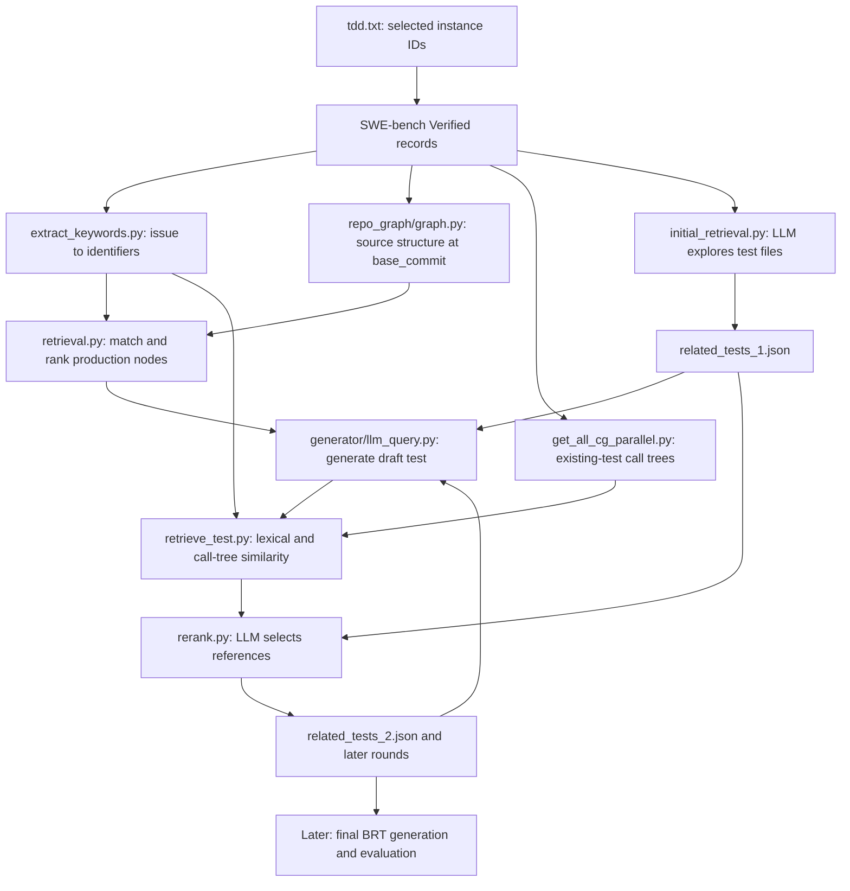

# How code retrieval and test retrieval work

This guide follows the implementation in this checkout, inspected on 2026-09-21. It explains the active Python entry points, their inputs and outputs, and the shell scripts that connect them. Function names below are searchable in the linked source files. Source links are relative to this document so they also work when the repository is moved or viewed on GitHub.

The two retrieval pipelines supply context for generating a **bug reproduction test (BRT)**:

- **Code retrieval** extracts identifiers from the issue description and finds corresponding production-code snippets at the buggy commit.
- **Test retrieval** selects existing tests as references, generates a draft BRT, compares that draft with existing tests, and refines the references over several rounds.

Retrieval does not establish that a generated test reproduces the bug. The later BRT evaluator runs a candidate on the buggy and fixed versions to establish that.

## 1. The complete data flow



Only keyword extraction, initial test exploration, draft generation, and reranking call the LLM. Source indexing, BM25 scoring, and tree comparison run locally.

There are **two different graph representations**:

| Representation | Builder | Purpose | Storage |
| --- | --- | --- | --- |
| Repository structure tree | `code_retrieval/repo_graph/graph.py` | Find files, classes, methods, functions, and global variables | One `{instance_id}_graph.pkl` per instance |
| Existing-test call trees | `test_retrieval/similarities/get_all_cg_parallel.py` | Compare the structure of a draft test with existing tests | `call_trees.db` and `df.json` per instance |

The first is primarily a containment hierarchy. The second uses static analysis of dependencies; neither is a trace recorded by executing the test suite.

## 2. Where the issues and repositories come from

### 2.1 Dataset records and selection files

The Python entry points call `datasets.load_dataset(...)["test"]`. They do not fetch GitHub issue pages one by one. The issue description is already in the dataset's `problem_statement` field.

| Record field | Use in retrieval |
| --- | --- |
| `instance_id` | Filter by selection file; identify all outputs |
| `repo` | Locate the cloned repository and its test directory |
| `base_commit` | Reset or check out the buggy source version |
| `version` | Select the benchmark environment and installation commands |
| `problem_statement` | Supply the issue description to the LLM |

For the current command-line conventions:

- `--tdd` selects Verified instances listed in `tdd.txt`.
- `--swt` selects Lite instances listed in `swt.txt`.
- Most Verified loaders use `princeton-nlp/SWE-bench_Verified`; the final code-retrieval entry point uses `SWE-bench/SWE-bench_Verified`. These are the literal identifiers in the source. The scripts do not pin a dataset revision.
- Several modules open **both** selection files even when only one flag is used. The launchers create the unused file if needed. For a Lite repository run, `SWT_IDS_FILE` points all active stages to the ID list generated from the dataset's `repo` field; `swt.txt` does not need editing.
- Pass one dataset flag, not both: precedence differs between entry points.

Example selection:

```text
pylint-dev__pylint-4551
pylint-dev__pylint-4604
pylint-dev__pylint-4661
scikit-learn__scikit-learn-10297
scikit-learn__scikit-learn-10844
scikit-learn__scikit-learn-10908
pallets__flask-5014
```

Each stage independently selects matching dataset records. Processing order follows the dataset, not necessarily the order of lines in `tdd.txt`. A selected ID that does not exist in that dataset is not processed. The shell launcher's artifact checks catch some resulting missing outputs.

The pipeline is **stage by stage across the selected instances**: initial retrieval for the selected batch finishes before draft generation for the batch begins. It is not one shell loop that completes every stage for the first ID before moving to the next.

Source: the `__main__` blocks in [extract_keywords.py](scripts/code_retrieval/extract_keywords.py), [retrieval.py](scripts/code_retrieval/retrieval.py), [initial_retrieval.py](scripts/test_retrieval/initial_retrieval.py), and [test_retrieval_flask.sh](test_retrieval_flask.sh).

### 2.2 Paths and environments

[scripts/config.py](scripts/config.py) defines:

```python
REPO_ROOT_DIR = '/research/cbim/vast/qt60/any-ssr/utils/iCore/repos'
ROOT_DIR = '.'
ENV_NAME_TEMPLATE = 'setup_{name1}_{name2}__{version}'
```

`repo_path("pallets/flask")` in [swe_util.py](scripts/utils/swe_util.py) resolves to `REPO_ROOT_DIR/flask/`. The owner is not part of that checkout's directory name. `get_env_name(record)` constructs a name such as `setup_pallets_flask__2.3`.

`get_conda_python()` discovers the interpreter through `conda env list --json`, using `CONDA_EXE` when set. On your server, a resulting interpreter can be:

```text
/research/cbim/vast/qt60/miniconda3/envs/setup_pallets_flask__2.3/bin/python
```

`CONDA_EXE`, if explicitly configured, is the executable `/research/cbim/vast/qt60/miniconda3/bin/conda`. It is not the directory containing the environments. Jedi uses the discovered target interpreter; the pipeline itself runs in the `icore` environment.

**Repository side effects:** `initialize()` in [git_utils.py](scripts/utils/git_utils.py) runs a hard reset to `base_commit` and removes untracked and ignored files from the configured target checkout. These checkouts should be disposable benchmark clones. Multiple simultaneous runs that reset the same base checkout can interfere with one another.

## 3. Production-code retrieval

### 3.1 Extract issue keywords

Source: [extract_keywords.py](scripts/code_retrieval/extract_keywords.py), `KEYWORD_EXTRACT_PROMPT`, `extract_keywords()`, and the main loop.

The function sends `problem_statement` to `query_chat_llm()` with temperature `0.0`. The prompt asks for actionable identifiers such as class names, methods, functions, variables, and module paths. It asks the model to restore import aliases, exclude generic words, and prioritize useful identifiers.

For example, an illustrative response might be:

```python
['flask.Blueprint', 'Blueprint.__init__', 'name']
```

The parser extracts a fenced list, or a bracketed list from an unfenced response, removes comments with a regular expression, and uses `ast.literal_eval()`. This is separate from the more defensive parser used for selected tests. It does not currently enforce that every keyword is a string.

The output is an aggregate JSON mapping:

```json
{
  "pallets__flask-5014": ["flask.Blueprint", "Blueprint.__init__", "name"]
}
```

On a caught extraction error, the value becomes `null`. A later run retries `null` entries; any existing non-null entry is skipped, including an empty list. The aggregate file is written in a `finally` block when the loop exits, rather than after each individual extraction. A forced process termination can still lose unsaved work.

Raw response logs are written under `keywords_log/{model}/{instance_id}.log`. A model ID containing `/` produces additional directory levels.

The progress bar now counts only IDs selected from the dataset. It can still reach 100% when all selected IDs were already cached, or when an extraction error was recorded as `null`; inspect the keyword JSON for usable lists.

### 3.2 Build the repository structure tree

Source: [repo_graph/graph.py](scripts/code_retrieval/repo_graph/graph.py), `process_single_item()`, `get_graph_info()`, `Node`, and `NodeType`; AST helpers live in [search_utils.py](scripts/code_retrieval/repo_graph/search_utils.py).

For each selected instance without an existing graph file:

1. Copy the base clone to `REPO_ROOT_DIR/{instance_id}/{repo_basename}` if that workspace does not already exist.
2. Force-check out the instance's `base_commit` in the workspace.
3. Discover Python files and parse their source with `ast`.
4. Build a hierarchy and save it using pickle.
5. Remove that instance workspace after successful graph generation.

The hierarchy has this shape:

```text
repo_root
└── file node
    ├── class node
    │   └── method node
    ├── top-level function node
    └── global-variable node
```

`get_all_py_files()` applies path exclusions for build/docs files, selected fixtures/templates, and many test paths. These are repository-specific heuristics, not a general import-aware classifier of production code.

Each `Node` stores the name, type, file path, line range, source snippet, parent, and children. Important details:

- Class snippets use `get_class_signature()`, rather than storing every method body in the class node.
- Function and method nodes hold their corresponding source snippets.
- File nodes currently contain the placeholder string `"file_content"`.
- `reference_who` and `who_reference_me` exist on `Node`, but the active `get_graph_info()` path does not build the extra reference links.
- `get_graph_info_filter()` contains an alternative reference-analysis path; the launcher does not call it.
- File-level exceptions are printed and processing continues. A saved graph can therefore be incomplete even if the instance worker reports success.

Output:

```text
retrieval_results/graphs/pallets__flask-5014_graph.pkl
```

### 3.3 Match each keyword to candidate nodes

Source: [retrieval.py](scripts/code_retrieval/retrieval.py), `retrieve_keywords()`; [graph.py](scripts/code_retrieval/repo_graph/graph.py), `Node.find_node_by_name()` and `Node.find_node_by_module_path()`.

The retrieval stage resets the base clone, loads the saved graph and keyword list, and dispatches each keyword:

| Keyword form | Actual behavior |
| --- | --- |
| `Blueprint` | Recursively find nodes with exactly that name |
| `Blueprint.__init__` or another dotted identifier | Search the final component, then attempt module/class disambiguation |
| `src/flask/blueprints.py` or any keyword ending in `.py` | Currently produces no candidates; file-path retrieval is unfinished |

For a dotted identifier, `find_node_by_module_path()` first searches by its final component. If zero or one candidate exists, it returns immediately. For multiple candidates it creates a Jedi project using the benchmark interpreter, constructs a small import/access snippet, and asks Jedi to resolve the definition. If Jedi returns no definitions, it tries matching the parent-name chain. The caller falls back to the final component when no candidate remains.

This is heuristic resolution. For example, constructing an import from the repository basename does not always match a project's real import package name. Also, errors creating the Jedi environment occur outside the `goto()` exception handler and can stop retrieval.

### 3.4 Rank ambiguous candidates

Source: [retrieval.py](scripts/code_retrieval/retrieval.py), `filter_retrieval_results()`.

Let `C(k)` be the candidate nodes for keyword `k`. Each matched keyword contributes a total score of one, split equally across its candidates:

```text
node_score(n) = sum over keywords k containing n of 1 / len(C(k))

file_score(f) = sum over every candidate occurrence n in file f
               of 1 / len(C(k))

final_score(n) = node_score(n)
                + file_score(n.path)
                + node_score(n.parent, default=0)
```

The file term favors files supported by several keywords. The parent term favors a method when its class is also supported. One highest-scoring node is retained for each keyword. There is no final global top-k across all keywords, and the prompt's keyword ordering is not used as a numerical weight.

Illustrative calculation: keyword A finds nodes X and Y in different files, contributing `0.5` each. Keyword B finds only X, contributing another `1.0`. With no parent contribution, X scores `1.5 + 1.5 = 3.0`; Y scores `0.5 + 0.5 = 1.0`. X wins for A. Multiple matches in the same file accumulate in `file_score` too.

The function mutates `results` in place. That is why the main loop can assign its return value to `filter_results` and still save `results` correctly.

### 3.5 Production-context output

The output shape is:

```text
{
  instance_id: {
    keyword: {
      obj_name, node_type, path,
      code_start_line, code_end_line, code_content, parent
    },
    unmatched_keyword: null
  }
}
```

`node_type` is one of `repo`, `file`, `class`, `class_function`, `top-level function`, or `global_var`. The exported `parent` is the parent's name, not another nested node. Scores and graph edges are not exported.

Later, `get_retrieval_docs()` in [generator/make_prompt_util.py](scripts/generator/make_prompt_util.py) skips null entries, formats the snippets, qualifies method names with their parent class, and removes identical formatted snippets. The generated prompt thus receives source text, not the pickle graph.

## 4. Test retrieval

### 4.1 Precompute existing-test call trees

Source: [get_all_cg_parallel.py](scripts/test_retrieval/similarities/get_all_cg_parallel.py), `process_bug_report_in_workspace()`, `build_all_cg()`, `extract_tree_from_graph()`, and `build_df()`.

The worker copies/checks out an instance workspace, discovers files under the test-path pattern from `swe_test_path_prefix()`, and passes the selected test files to `pyan.analyzer.CallGraphVisitor`.

Despite a log message saying “entire repository,” the actual call is:

```python
visitor = CallGraphVisitor(test_files, root=repo_dir)
```

The analyzer receives files whose basenames start with `test` or `unittest` under the relevant test path. It is not given every production and helper source file. Its static `uses_edges` should therefore not be interpreted as complete runtime call coverage.

For each detected test function or method whose short name starts with `test`, the code builds a tree:

- Root: the test function.
- Children: nodes reached through `uses_edges`, sorted by name.
- Depth limit: `MAX_CALL_DEPTH = 5`.
- Cycles stop at a node marked `recursive`; depth limits produce `truncated` nodes.

Each tree is serialized to JSON inside SQLite:

```sql
CREATE TABLE call_trees (
    test_name TEXT PRIMARY KEY,
    tree_json TEXT NOT NULL
);
```

A tree contains `name`, `children`, and optional `recursive` or `truncated` flags. `df.json` contains:

```text
{
  "total_documents": number_of_test_trees,
  "df": {node_name: number_of_test_trees_containing_that_node}
}
```

Within each tree, a node contributes at most once to document frequency; the root test name is excluded. This measures how widely a dependency appears across tests, not the number of times it is called.

Unlike production-graph generation, this worker currently leaves the copied instance workspace on disk. Copies and call-tree databases can accumulate as more instances are selected.

### 4.2 Initial selection: the LLM explores existing tests

Source: [initial_retrieval.py](scripts/test_retrieval/initial_retrieval.py), `chat_with_llm()` and `extract_function_call()`; tools are in [function_calls.py](scripts/test_retrieval/function_calls.py).

The initial prompt contains the bug report and instructions to recommend up to five test functions. It does not include the retrieved production-code JSON at this stage.

On a fresh conversation the first request explicitly chooses `list_root`. Subsequent requests let the model decide whether to call another tool or return a final answer:

| Tool | Implementation |
| --- | --- |
| `list_root()` | List entries beneath the project's configured test-root pattern |
| `list_folder(folder)` | List Python files and subdirectories in a relative directory |
| `list_classes_and_functions(file_path)` | Delegate to the test-discovery helper; this lists recognized tests, despite the broader tool name |
| `read_function(file_path, function_name)` | Read the source for the requested function or class method |

The loop reconstructs streamed tool-call arguments, dispatches the tool, appends its result as a `tool` message, and saves the conversation. These tools browse source; they do not run the tests.

The prompt says “maximum number of steps is 10,” but the loop is `while True`: there is no enforced ten-turn limit. The counter in initial retrieval limits tool-execution exceptions, not successful exploration steps.

The final answer should be a list of pairs:

```python
[
    ["tests/test_blueprints.py", "test_dotted_name_not_allowed"]
]
```

### 4.3 Parse the selection and load actual source

Source: [response_parser.py](scripts/test_retrieval/response_parser.py), `parse_test_selection()`; [test_retrieval/utils.py](scripts/test_retrieval/utils.py), `get_related_test()`; [generator/make_prompt_util.py](scripts/generator/make_prompt_util.py), `get_function_content()`.

The current selection parser removes complete `<think>...</think>` sections, examines fenced blocks or raw text, identifies balanced lists using tokenization, and parses them with `ast.literal_eval()`. It accepts only a list of two-element pairs containing nonempty strings. It tolerates surrounding prose and Python-style lists, and rejects multiple different valid selection lists as ambiguous. It does not execute model-produced code.

This avoids the old failure where `json.loads()` reported `Extra data` because explanation text followed a valid list. It does not repair a truly malformed list. The caller adds the instance ID and saved-message path to parsing errors.

`get_related_test()` then reads the named functions from the checked-out repository. It drops missing/empty source and duplicate selections with the same file and final function-name component. Consequently, a valid model answer can still produce fewer references, or even an empty list. The requested maximum of five is prompt guidance, not a limit enforced by this parser.

The saved format is:

```json
{
  "pallets__flask-5014": [
    {
      "name": "test_dotted_name_not_allowed",
      "file": "tests/test_blueprints.py",
      "code_content": "def test_dotted_name_not_allowed(app, client):\n    with pytest.raises(ValueError):\n        flask.Blueprint(\"app.ui\", __name__)"
    }
  ]
}
```

This illustrates the schema; it is not a claim about the exact contents of your current artifact. The `code_content` comes from the repository lookup, not from asking the model to reproduce the selected function.

The aggregate selection file is checkpointed after each successful instance. Raw messages are stored separately in `messages/initial/{instance_id}.json`.

### 4.4 Generate a draft test for round i

Source: [generator/llm_query.py](scripts/generator/llm_query.py), `make_messages_from_dataset()`, `query_llm_for_gentest()`, and `query_times()`; template: [prompt_with_code_and_tests.json](data/prompt_templates/prompt_with_code_and_tests.json).

Although this module is outside `test_retrieval/`, it supplies the query used by the next retrieval step. Its inputs are:

```text
issue description
  + retrieved production snippets
  + related_tests_i.json
  + prompt template
  -> draft test source
```

The generator fills the template placeholders and calls the model. It removes reasoning sections, result tags, and code fences when recognized. The launcher requests one draft per instance per round (`--query_time 1`) with temperature `0.0`.

Example output:

```text
data/nemo/iteration_1/pallets__flask-5014_n1.txt
```

These files contain generated Python text, not selected existing tests. Saving a draft does not guarantee that it parses, imports, or passes. The generator stops on a missing model response, but it does not perform full syntax or BRT validation before writing.

There is also a prompt cache lookup under `data/{exp_name}/prompts/{instance_id}.json`. If such a file already exists, `make_messages_from_dataset()` uses it instead of rebuilding the prompt. Changing context paths alone does not invalidate an existing cached prompt.

### 4.5 Collect existing tests for comparison

Source: [retrieve_test.py](scripts/test_retrieval/retrieve_test.py), `retrieval()`; [related_test_util.py](scripts/utils/related_test_util.py), `list_all_tests_in_file()`.

For each instance, `retrieval()` resets the source checkout and reads `{instance_id}_n1.txt`. It enumerates matching test files and extracts tests with AST-based rules:

- Top-level functions/async functions whose names start with `test`.
- Methods containing `test` in recognized test classes: the class name contains `Test`, or a simple named base class contains `Test`.

This is a source-discovery heuristic, not pytest's complete collection machinery. Parse failures return no tests for the affected file.

Each discovered function becomes a `Test` object with path, class, name, source content, and score fields. The code records whether its file/name matches the previous LLM selection. Those two Boolean fields are exported for inspection but **do not contribute to the current final-score formula**.

### 4.6 Lexical similarity, named “semantic similarity” in the code

Source: [textual_similarity.py](scripts/test_retrieval/similarities/textual_similarity.py), `normalize_and_tokenize()`, `get_name_similarity()`, `get_code_similarity()`, and `get_semantic_similarity()`.

The implementation uses **BM25**, not embeddings or another LLM call.

Tokenization removes `.py`, splits CamelCase and snake_case, lowercases text, removes punctuation, lemmatizes with NLTK WordNet, and drops the token `test`. NLTK's `wordnet` data must be available in the pipeline environment.

There are two comparisons:

1. **Names:** generated test/class names are the query; existing file path + class + test name form each document.
2. **Code:** the whole generated draft is the query; each existing test's source is a document.

Let `N(x)` mean min-max normalization over the current candidate set:

```text
N(x_j) = (x_j - min(x)) / (max(x) - min(x))

name_similarity = N(BM25(name query, existing names))
bm25_similarity = N(BM25(draft source, existing test source))
semantic_similarity = N(0.5 * name_similarity + 0.5 * bm25_similarity)
```

`similarity_minmax_normalize()` returns all zeroes when all input values are equal. It does not special-case an empty input. These are relative scores within one retrieval operation, not probabilities or calibrated relevance measurements.

Only positive semantic scores enter the initial result table. The script saves the top `--topk` semantic results, default five. It uses the minimum score among the top 100 positive results as the cutoff for structural comparison. Ties can admit more than 100 tests.

### 4.7 Build the draft's call tree

Source: [call_tree_similarity.py](scripts/test_retrieval/similarities/call_tree_similarity.py), `build_gen_test_call_graph()`; [tree_edit_distance.py](scripts/test_retrieval/similarities/tree_edit_distance.py), `WeightedTreeBuilder.get_call_graph()`.

Unless `--wo_call` is set:

1. `setup_environment()` in [postprocess_swe.py](scripts/libro/postprocess_swe.py) activates the target Conda environment and runs the configured project installation/setup commands.
2. `inject_test()` places the draft in the repository using the current related-test JSON as placement context.
3. The code uses the first returned injected-test identifier and statically analyzes its containing file.
4. The draft tree follows `uses_edges` **and** `defines_edges`, with depth capped by `build_zss_tree()`.
5. `git_reset()` restores tracked checkout files after the build returns normally.

This stage invokes installation/import/injection helpers, but it does not call the later buggy/fixed test evaluator. The existing-test precomputation and draft-tree construction are asymmetric: stored trees follow only `uses_edges`, while draft trees also follow definition edges.

If setup or draft-tree construction fails, `retrieval()` generally switches to lexical-only retrieval. An injection failure also produces this fallback. The normal reset is not in a `finally` block, so cleanup after exceptional paths is not guaranteed by that code block.

### 4.8 Weight nodes and compare trees

Source: [tree_edit_distance.py](scripts/test_retrieval/similarities/tree_edit_distance.py), `get_node_weight()`, `set_tree_weight()`, `label_distance()`, and `calc_tree_distance()`; [call_tree_similarity.py](scripts/test_retrieval/similarities/call_tree_similarity.py), `get_call_graph_similarities()`.

The builder loads the instance's keywords, SQLite trees, and document frequencies. Keyword matches receive weight `1.0`. The implemented match checks use `fnmatch.fnmatch(keyword, node_full_name)` for dotted keywords, or equality between a keyword and the node's final name component.

For other nodes, let `D` be the number of stored test trees, `df(n)` their document frequency, and `p1 = 0.1` by default:

```text
if df(n) == 0 or df(n) >= D:
    weight(n) = p1
else:
    max_idf = log10(D) if D > 1 else 1.0
    weight(n) = max(p1,
                    p1 + (0.9 - p1) * log10(D / (df(n) + 1)) / max_idf)
```

Rare known dependencies get more weight than very common ones. Unknown nodes receive the baseline rather than a maximum rarity weight.

After sorting child nodes by name, `zss.simple_distance()` computes weighted tree edit distance:

- Equal node names: zero substitution cost.
- Different names: sum of their weights.
- Insertion/deletion: the corresponding node's weight.

The raw structural similarity is:

```text
call_similarity_raw = 1 - edit_distance(query_tree, candidate_tree)
                         / (total_weight(query_tree) + total_weight(candidate_tree))

call_graph_similarity = min_max_normalize(call_similarity_raw)
```

A missing candidate tree yields raw similarity zero. Database lookup uses an exact constructed name derived from the candidate path and test name; a namespace mismatch can therefore yield “Tree not found” even when the database contains other trees.

Two implementation details matter when interpreting experiments:

- `--p1` is not propagated through every recursive weighting call or to the candidate-tree weighting call. Nondefault values do not uniformly change the baseline for all nodes.
- The draft builder assigns `use_tree.label = 'test_name'`, but comparison reads `node.name`. That assignment does not actually normalize the root name used by the distance calculation.

### 4.9 Combine scores and write the candidate tables

Source: [test_retrieval/utils.py](scripts/test_retrieval/utils.py), `Test.calc_final_score()`; [retrieve_test.py](scripts/test_retrieval/retrieve_test.py).

```text
score = 0.5 * semantic_similarity + 0.5 * call_graph_similarity
```

Despite their names, `SEMANTIC_SIMILARITY_THRESHOLD` and `FUNC_CALL_SIMILARITY_THRESHOLD` are used as multiplicative weights here, not cutoff thresholds.

The default outputs for each round and instance are:

| File | Meaning |
| --- | --- |
| `semantic.csv` | Top lexical matches across discovered tests |
| `call.csv` | Top structural matches among the semantic shortlist |
| `score.csv` | Top combined-score matches among the semantic shortlist |

Each CSV includes the path/class/name, the name/BM25/semantic/call scores, previous-selection flags, and combined score. `semantic.csv` is built before structural scoring, so its `call_graph_similarity` and `score` fields retain their initial zero values. Use `score.csv` for combined scores.

In lexical-only mode, only `semantic.csv` is produced, with at least ten requested rows (`topk = max(10, topk)`, subject to available positive results). A normal run that automatically falls back can recompute on the next invocation because its cache rule still expects all three CSV files.

### 4.10 Rerank and start the next round

Source: [rerank.py](scripts/test_retrieval/rerank.py), `list_candidates()` and `chat_with_llm()`.

With structural results available, reranking combines:

```text
top-k call.csv tests
  + top-k semantic.csv tests
  + top-k score.csv tests
  + previous selected references
```

Duplicates are removed with a Python `set` of formatted test snippets. This means candidate prompt order is not guaranteed to be stable between processes. If structural CSVs are missing, reranking instead combines up to `2 * topk` semantic candidates with previous references.

The model receives the bug report plus those candidate snippets and is asked to select up to `topk` references, default five. It can use the same browsing tools to find better tests outside the shortlist. The final answer passes through `parse_test_selection()` and repository source lookup again.

The outputs are `related_tests_{i+1}.json` and `messages/rerank_{i}/{instance_id}.json`. The next round regenerates a draft using this refined context. Production-code context and precomputed existing-test trees are reused across rounds.

There is no automatic convergence check or stop when two selections become identical. The shell runs the configured number of rounds.

## 5. What one, two, or three iterations mean

Source: [test_retrieval_flask.sh](test_retrieval_flask.sh).

Initial retrieval creates `related_tests_1.json`. Each refinement round adds one more selection file:

```text
Initial exploration -> related_tests_1.json

Round 1: references 1 -> draft 1 -> similarity 1 -> references 2
Round 2: references 2 -> draft 2 -> similarity 2 -> references 3
Round 3: references 3 -> draft 3 -> similarity 3 -> references 4
```

The current script defaults to **two** rounds via `ITERATIONS="${ITERATIONS:-2}"`, regardless of the nearby comment describing a one-round trial. To request three:

```bash
ITERATIONS=3 bash test_retrieval_flask.sh
```

Three rounds mean three retrieval drafts per selected instance and a final `related_tests_4.json`. This differs from `--query_time`, which controls the number of generated samples within a generator invocation. Retrieval currently reads only `_n1.txt`.

The last retrieval draft uses `related_tests_3.json`; final BRT generation must consume `related_tests_4.json` to use the final refinement. [run_brt_flask.sh](run_brt_flask.sh) is the separate downstream launcher.

## 6. Current launchers and consistent commands

### 6.1 Differences between the files in this checkout

| Launcher | Current behavior |
| --- | --- |
| [code_retrieval_flask.sh](code_retrieval_flask.sh) | Enforces exactly `pallets__flask-5014`; writes `flask_keywords.json` and `flask_retrieval_results.json`; one graph worker |
| [code_retrieval_lite.sh](code_retrieval_lite.sh) | Defaults to `REPO=pylint-dev/pylint`; selects all that repo's Lite IDs directly from the dataset, checks its base clone and commits, and writes `nemo_*_lite.json` outputs |
| [test_retrieval_flask.sh](test_retrieval_flask.sh) | Defaults to Verified with `tdd.txt`, `nemo_keywords.json`, and `nemo_retrieval_results.json`; `DATASET=lite REPO=owner/name` reads that repo's saved Lite ID list and the `nemo_*_lite.json` artifacts; one call-tree worker; configurable rounds |
| [code_retrieval.sh](code_retrieval.sh) | Older launcher: passes `--keywords_path` to the graph builder and `--graph_path` to keyword extraction, neither of which accepts that flag |
| [test_retrieval.sh](test_retrieval.sh) | Older launcher: call-tree command inherits the `django` project default; similarity repeatedly reads round-one drafts; `${i+1}` is not arithmetic addition in Bash; rerank messages share a directory |

Thus, the Flask code launcher and current multi-instance test launcher do not connect automatically without consistent artifact paths. File prefixes such as `flask` and `nemo` do not filter the Python stages; selection files and project flags do. The explicit single-Flask guard in the code launcher does impose that restriction.

### 6.2 Generate the code artifacts expected by the current test launcher

The following Linux/Bash commands use the current `nemo_*` paths and work with the selected Verified IDs, provided their repositories and benchmark environments have already been set up. Run from the iCoRe root with the `icore` environment active and credentials exported.

```bash
touch swt.txt
mkdir -p retrieval_results/code retrieval_results/graphs

python -m scripts.code_retrieval.extract_keywords \
  --tdd \
  --model 'nvidia/nemotron-3-super-120b-a12b:free' \
  --keywords_path ./retrieval_results/code/nemo_keywords.json

python -m scripts.code_retrieval.repo_graph.graph \
  --tdd --max_workers 1 \
  --graph_path ./retrieval_results/graphs

python -m scripts.code_retrieval.retrieval \
  --tdd \
  --keywords_path ./retrieval_results/code/nemo_keywords.json \
  --graph_dir ./retrieval_results/graphs \
  --save_path ./retrieval_results/code/nemo_retrieval_results.json

ITERATIONS=3 bash test_retrieval_flask.sh
```

Before the final code-retrieval command, check that selected keyword values are nonempty lists rather than `null`; that command expects iterable keywords. It does not perform the Flask launcher's explicit keyword validation.

The model ID above is the literal value configured in the current script, not a guarantee of current provider availability or capacity. In the present [config.py](scripts/config.py), it reads `QWEN_API_KEY` and `QWEN_BASE_URL`, including when used through OpenRouter. The key variable's name does not determine the model. The configured OpenRouter base URL is supplied through the environment as `https://openrouter.ai/api/v1`.

The test launcher validates the ID list and checks for truthy code/keyword entries for every selected ID before starting. This is a presence check: a nonempty code dictionary whose values are all null can still pass. It also checks for nonempty call-tree files and drafts after those stages. It does not prove the files are semantically valid.

### 6.3 Output directory map for three rounds

```text
retrieval_results/
├── code/
│   ├── nemo_keywords.json
│   └── nemo_retrieval_results.json
├── graphs/
│   └── {instance_id}_graph.pkl
├── swe_test_cgs/
│   └── {instance_id}/
│       ├── call_trees.db
│       └── df.json
└── test/nemo_retrieval_results/
    ├── related_tests_1.json
    ├── related_tests_2.json
    ├── related_tests_3.json
    ├── related_tests_4.json
    ├── messages/
    │   ├── initial/{instance_id}.json
    │   ├── rerank_1/{instance_id}.json
    │   ├── rerank_2/{instance_id}.json
    │   └── rerank_3/{instance_id}.json
    └── similarity/
        ├── 1/{instance_id}/{semantic,call,score}.csv
        ├── 2/{instance_id}/{semantic,call,score}.csv
        └── 3/{instance_id}/{semantic,call,score}.csv

data/nemo/
├── iteration_1/{instance_id}_n1.txt
├── iteration_2/{instance_id}_n1.txt
└── iteration_3/{instance_id}_n1.txt
```

The brace notation in this diagram abbreviates multiple files. Lexical-only rounds may have only `semantic.csv`.

## 7. Resume behavior: exactly what is skipped

The code mostly recognizes completion by file existence or instance-key presence. It does not hash the model, prompt, inputs, or source version to validate a cache.

| Stage | Skip condition | Caveat |
| --- | --- | --- |
| Keywords | Instance exists with a non-null value | Empty lists are also skipped |
| Production graph | `{id}_graph.pkl` exists | No integrity/content validation |
| Production retrieval | Instance key exists in output JSON | Even a poor/empty result is considered done; aggregate writes occur at loop end |
| Existing-test call trees | Both `call_trees.db` and `df.json` exist | Neither completeness nor useful tree count is checked |
| Initial selection | Instance key exists in related-test JSON | Empty selections also skip; `--restart` does not override this outer skip |
| Initial messages | Last saved message has role `assistant` | Reuses final content for parsing without a new API request; role alone is a weak completion check |
| Draft generation | Output `_n1.txt` exists and `--retry` is absent | Does not check syntax or emptiness before skipping |
| Similarity | `semantic.csv` plus both structural CSVs exist; or semantic alone with explicit `--wo_call` | Automatic fallback alone does not satisfy a later normal run's skip rule |
| Reranking | Instance key exists in output related-test JSON | Otherwise a saved final assistant message can be parsed and reused |

If you already collected complete files under `messages/initial/`, rerunning initial retrieval normally loads those conversations and parses their final assistant answer. It does not need another model request for a completed conversation. If the aggregate already has that instance key, the entire instance is skipped even earlier.

If a conversation ends in a `tool` message, the code continues it with another model request. If a saved final answer remains unparseable, reusing it produces the same parsing error; API retries are not a format-repair loop.

Changing the model or keyword/context contents while reusing the same output paths does not automatically recompute downstream artifacts. For a deliberate fresh experiment, use distinct output directories and an experiment name that does not reuse a saved prompt. To repair one cached failure, first inspect the affected artifacts and invalidate only the relevant instance/stages; retain the original files for comparison.

## 8. Failure messages and what they actually indicate

| Message/symptom | Relevant code and interpretation |
| --- | --- |
| Hugging Face metadata `404` followed by dataset progress | A metadata lookup did not find a file; it is not itself an LLM error or proof that dataset loading failed. Look for an actual dataset exception. |
| `429` or “temporarily overloaded” | Model-provider request failure; handled by `create_chat_completion()` in [llm_api.py](scripts/utils/llm_api.py) when classified as transient |
| “No endpoints found that support tool use” | Initial retrieval/reranking send tool schemas; the selected endpoint must support those requests. Keyword extraction alone does not exercise that requirement. |
| Keyword value `null` | Extraction failed and was recorded as retryable on the next run |
| `No tasks found for project ...` | Call-tree task list became empty after both project filtering and cache filtering; it can mean everything is already cached |
| `InvalidPythonEnvironment` from Jedi | Production-node disambiguation could not use the benchmark interpreter; interpreter existence alone does not prove Jedi subprocess compatibility |
| `Function ... not found` | Model-selected path/name was not resolved to source; the selected test may be dropped |
| `Extra data` at old `json.loads(s_clean)` | Old selection parsing path; current initial retrieval/reranking use `parse_test_selection()` |
| `wordnet` missing | Local lexical normalization cannot lemmatize; this is independent of provider capacity |
| “Tree not found in DB” | Exact candidate-tree lookup failed; that candidate gets zero raw structural similarity |
| Only `related_tests_1.json` exists | Initial selection is present; it does not demonstrate completion of a refinement round |
| A progress bar reaches `100%` | The loop ended, possibly after skips or recorded errors; inspect outputs and exceptions |

`create_chat_completion()` disables the SDK's own automatic retry layer and makes up to five attempts. Default delays between attempts are 30, 60, 120, and 120 seconds. It respects a longer `Retry-After` value, but stops if the requested wait exceeds 300 seconds. Its transient classification covers rate limits, server errors, and selected temporary-overload messages; it does not retry every error, including arbitrary connection failures or bad model configuration.

For streaming requests, it buffers an entire response before passing chunks to the tool caller. If a stream fails with a retryable error, partial text/tool arguments from that attempt are discarded. This prevents tools from executing from a partial failed stream, at the cost of buffering the response in memory. Non-streaming responses are checked for provider error envelopes, missing choices, and missing assistant text.

## 9. Resource use and completion checks

Production and test graph builders accept `--max_workers`; more workers mean more simultaneous repository analysis and memory use. The current trial commands use one worker. Multiple instances of the same project can still require separate per-instance graphs because they refer to different commits.

The main disk consumers are Conda environments, base repository clones, retained test-analysis workspaces, graph artifacts, and saved prompts/responses. Keyword and context JSON files are separate from the environment installation directories. Test-tree generation currently keeps all extracted trees in memory while creating its document-frequency map, even though it writes the trees to SQLite too.

Before treating a three-round retrieval run as complete, inspect:

1. A useful keyword list and resolved production snippets for every selected ID.
2. Both call-tree files for every instance, with actual tree rows if structural retrieval is expected.
3. Initial selections with real source content; retained conversations for diagnosing surprising selections.
4. A generated draft and similarity outputs for each of rounds 1 through 3, accounting for any lexical-only fallback.
5. A `related_tests_4.json` entry for every selected ID, containing usable references.

These establish that retrieval produced context. Only the downstream buggy/fixed evaluation establishes BRT success. A syntax error reported before those executions can yield an error string rather than a report with `buggy` and `fixed` fields.

## 10. Source navigation index

| Question | Start here |
| --- | --- |
| How are issue identifiers extracted? | [extract_keywords.py](scripts/code_retrieval/extract_keywords.py): `extract_keywords` |
| How are production nodes represented and built? | [graph.py](scripts/code_retrieval/repo_graph/graph.py): `Node`, `get_graph_info`, `process_single_item` |
| Which source files and AST snippets are indexed? | [search_utils.py](scripts/code_retrieval/repo_graph/search_utils.py): `get_all_py_files`, class/function helpers |
| How are production matches ranked? | [retrieval.py](scripts/code_retrieval/retrieval.py): `retrieve_keywords`, `filter_retrieval_results` |
| How does the model browse tests? | [initial_retrieval.py](scripts/test_retrieval/initial_retrieval.py): `chat_with_llm`; [function_calls.py](scripts/test_retrieval/function_calls.py): `FunctionCalls`, `get_tools` |
| How is model selection text parsed? | [response_parser.py](scripts/test_retrieval/response_parser.py): `parse_test_selection` |
| How are selected references materialized? | [test_retrieval/utils.py](scripts/test_retrieval/utils.py): `get_related_test`; [make_prompt_util.py](scripts/generator/make_prompt_util.py): `get_function_content` |
| How are existing tests enumerated? | [related_test_util.py](scripts/utils/related_test_util.py): `list_all_tests_in_file` |
| How are call-tree artifacts created? | [get_all_cg_parallel.py](scripts/test_retrieval/similarities/get_all_cg_parallel.py): `build_all_cg`, `build_df` |
| How is one similarity round orchestrated? | [retrieve_test.py](scripts/test_retrieval/retrieve_test.py): `retrieval` |
| How does lexical scoring work? | [textual_similarity.py](scripts/test_retrieval/similarities/textual_similarity.py): `get_semantic_similarity` |
| How is the generated tree compared to cached trees? | [call_tree_similarity.py](scripts/test_retrieval/similarities/call_tree_similarity.py): `build_gen_test_call_graph`, `get_call_graph_similarities` |
| Where are weights and edit costs defined? | [tree_edit_distance.py](scripts/test_retrieval/similarities/tree_edit_distance.py): `WeightedTreeBuilder`, `calc_tree_distance` |
| Where is the final numerical score defined? | [test_retrieval/utils.py](scripts/test_retrieval/utils.py): `Test.calc_final_score` |
| How does the model choose the next references? | [rerank.py](scripts/test_retrieval/rerank.py): `list_candidates`, `chat_with_llm` |
| How are draft prompts and files produced? | [llm_query.py](scripts/generator/llm_query.py): `make_messages_from_dataset`, `query_times` |
| How are API failures handled? | [llm_api.py](scripts/utils/llm_api.py): `create_chat_completion`, `validate_completion`, `query_chat_llm` |
| Where are paths, environment names, and source resets defined? | [config.py](scripts/config.py), [swe_util.py](scripts/utils/swe_util.py), [git_utils.py](scripts/utils/git_utils.py) |
| Which file connects the multi-instance rounds? | [test_retrieval_flask.sh](test_retrieval_flask.sh) |

The explanations above describe the active launcher paths. Utility functions present in a folder, such as the alternate graph/reference builder or older helpers in [code_retrieval/utils.py](scripts/code_retrieval/utils.py), should not be assumed to execute unless an active entry point calls them.
